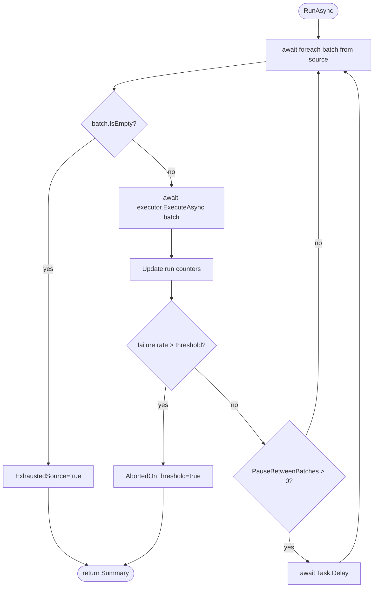
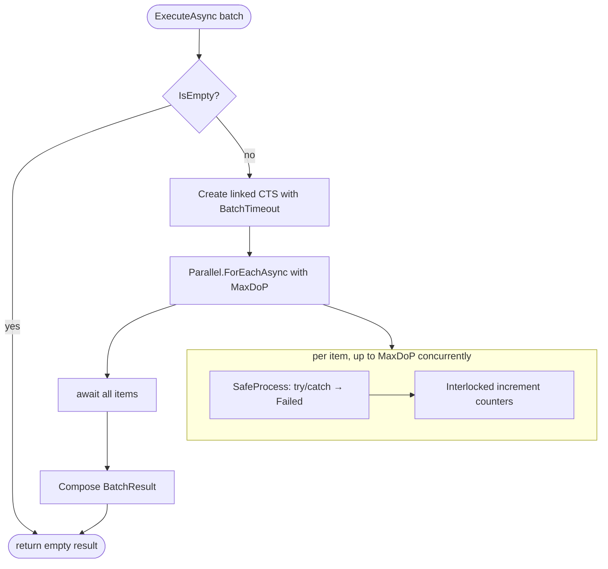
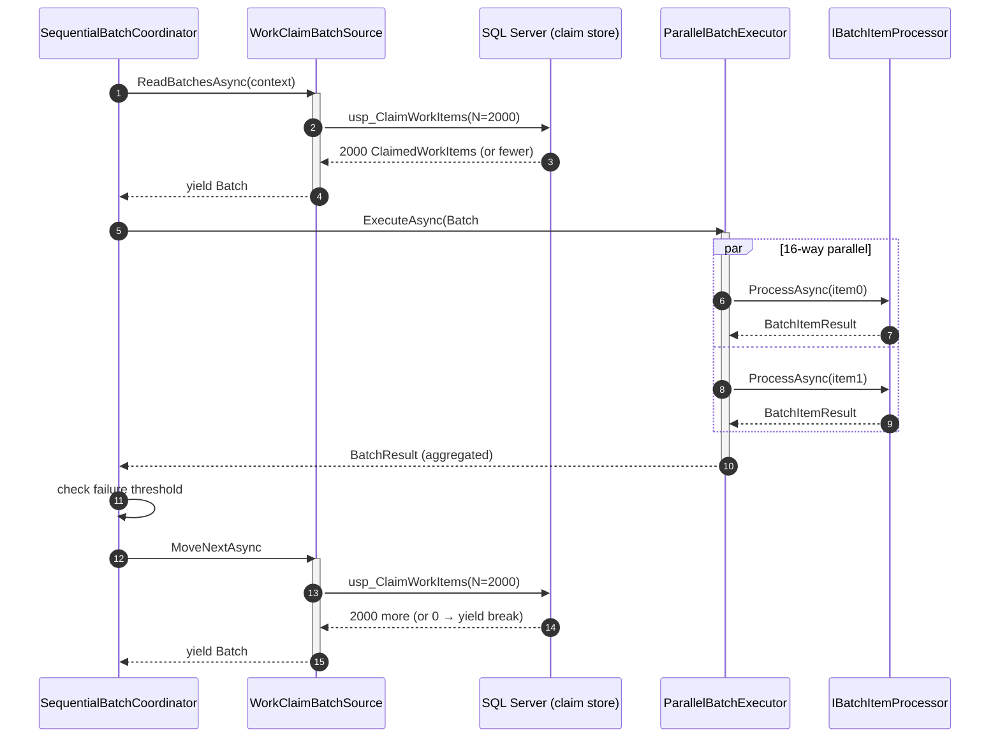

# Batch Processing Engine

**Scope**: A generic batch processor that pairs with the work-claiming
engine to process ~5 041 559 documents with **bounded memory** (never load
all items at once), **sequential batches**, and **parallel items inside a
batch**. Resumable via the claim engine's lease reclamation.

**Ground rules**:

1. Never materialize the whole set. `IBatchSource<T>` is `IAsyncEnumerable`.
2. Sequential batches. The coordinator awaits batch N before starting N+1.
3. Parallel inside a batch. `Parallel.ForEachAsync` with a bounded MaxDoP.
4. Resume is a property of the *source*, not the coordinator. The
   default source (`WorkClaimBatchSource`) resumes trivially because the
   claim engine returns crashed workers' items to `Available`.

---

## Architecture

```
                            ┌──────────────────────────────────────┐
                            │      IBatchCoordinator               │  (SequentialBatchCoordinator)
                            │   for each Batch in Source:          │
                            │     await Executor.ExecuteAsync()    │
                            │     check failure threshold          │
                            │     optional pause                   │
                            └──────────────┬───────────────────────┘
                                           │
                        ┌──────────────────┴───────────────────┐
                        │                                      │
                        ▼                                      ▼
        ┌───────────────────────────┐            ┌────────────────────────────┐
        │   IBatchSource<T>          │            │   IBatchExecutor           │
        │   IAsyncEnumerable batches │            │   ParallelBatchExecutor    │
        │                            │            │   Parallel.ForEachAsync    │
        │   (WorkClaimBatchSource)   │            │   bounded MaxDoP           │
        └───────┬────────────────────┘            └──────────┬─────────────────┘
                │                                            │
                ▼                                            ▼
        ┌───────────────────────┐               ┌────────────────────────────┐
        │   IWorkClaimStore     │               │  IBatchItemProcessor<T>    │
        │   ClaimAsync(N)       │               │  (caller-supplied,         │
        │   → yields one batch  │               │   e.g. document exporter)  │
        └───────────────────────┘               └────────────────────────────┘
```

---

## Threading model

- **Coordinator thread**: single. Awaits one batch at a time. Never contends
  with itself.
- **Item threads inside a batch**: `Parallel.ForEachAsync` with
  `MaxDegreeOfParallelism = BatchProcessingOptions.MaxParallelismPerBatch`
  (default 16). Uses the shared thread pool; no dedicated threads.
- **Counter aggregation**: `Interlocked.Increment` / `Interlocked.Add` on
  long fields. No locks, no shared collections.
- **Cancellation**: two linked `CancellationTokenSource`s per batch —
  outer (from the coordinator) and inner (batch timeout). Cancelling either
  cancels the whole batch.
- **Between batches**: the coordinator resumes on whichever thread pool
  slot ran the last batch's completion continuation.

```
    time ─────────────────────────────────────────────────────────►

    coordinator │ ─ read ─┤await batch 1├─ read ─┤await batch 2├─ read ─┤...
                │
    batch 1     │         │item0│item1│item2│...│item2000│
                │         │(N-way parallel via Parallel.ForEachAsync)  │
    batch 2     │                                       │item0│item1│...│
                │                                       │(N-way parallel)│
```

Only one batch is "hot" at a time. This is what keeps memory bounded.

---

## Memory characteristics

| Component | Size |
|---|---|
| One batch of 2 000 `ClaimedWorkItem` records | ~2 000 × ~200 B ≈ **400 KB** |
| Per-item BLOB buffer (rented from ArrayPool) | **80 KB** (default `WriteBufferSize`) |
| 16 concurrent items | 16 × 80 KB = **1.28 MB** |
| Metric/status counters | few dozen bytes (Interlocked longs) |
| **Total working set** | **< 2 MB per worker** |

Compared to naively `SELECT`-ing all 5M documents into a `List<T>` — which
would be tens of GB before content is even fetched — this is bounded and
predictable across the whole run.

---

## Configuration

`BatchProcessingOptions` under `Exporter:BatchProcessing`:

| Key | Default | Purpose |
|---|---|---|
| `BatchSize` | **2 000** | Documents claimed per batch. |
| `MaxParallelismPerBatch` | 16 | Concurrent item processors within one batch. |
| `BatchTimeout` | 30 min | Hard timeout — cancels the batch and any in-flight items. |
| `PauseBetweenBatches` | 0 | Delay between batches; useful when back-pressuring an external service. |
| `FailureRateThreshold` | 0.5 | Abort the run if a single batch's failure ratio exceeds this. |
| `StopOnFirstFailure` | false | Abort the current batch on the first Failed item (rarely useful). |

Validated at host build time by `ExporterOptionsValidator`.

---

## Interfaces

```csharp
public interface IBatchSource<T>
{
    IAsyncEnumerable<Batch<T>> ReadBatchesAsync(BatchContext ctx, CancellationToken ct);
}

public interface IBatchItemProcessor<T>
{
    Task<BatchItemResult> ProcessAsync(T item, BatchContext ctx, CancellationToken ct);
}

public interface IBatchExecutor
{
    Task<BatchResult> ExecuteAsync<T>(
        Batch<T> batch,
        IBatchItemProcessor<T> processor,
        BatchContext ctx,
        CancellationToken ct);
}

public interface IBatchCoordinator
{
    Task<BatchProcessingSummary> RunAsync<T>(
        IBatchSource<T> source,
        IBatchItemProcessor<T> processor,
        BatchContext ctx,
        CancellationToken ct);
}
```

The processor is **caller-supplied**. A document exporter processor looks
like this (sketch — in the Export project):

```csharp
public sealed class DocumentExportBatchProcessor : IBatchItemProcessor<ClaimedWorkItem>
{
    public async Task<BatchItemResult> ProcessAsync(
        ClaimedWorkItem item, BatchContext ctx, CancellationToken ct)
    {
        try
        {
            // 1. Fetch BLOB (streaming, GetBytes-based)
            await using var content = await _contentReader.OpenAsync(item.DataFileVersionKey, ct);

            // 2. Write file (atomic temp+rename, SHA-256 keyed name)
            var result = await _sink.WriteAsync(descriptor, content.Content, ct);

            // 3. Complete the claim in the tracking DB (token-guarded)
            var owned = await _workStore.CompleteAsync(
                item.WorkItemId, item.ClaimToken,
                result.OutputPath, result.ChecksumHex, result.BytesWritten, ct);

            return owned
                ? BatchItemResult.Succeeded(result.BytesWritten)
                : BatchItemResult.Skipped("stale claim token");
        }
        catch (DocumentContentMissingException)
        {
            await _workStore.FailAsync(item.WorkItemId, item.ClaimToken,
                "content missing", isPermanent: true, TimeSpan.Zero, ct);
            return BatchItemResult.Skipped("content missing");
        }
        catch (Exception ex) when (ex is not OperationCanceledException)
        {
            await _workStore.FailAsync(item.WorkItemId, item.ClaimToken,
                ex.Message, isPermanent: false, TimeSpan.FromSeconds(60), ct);
            return BatchItemResult.Failed(ex.Message);
        }
    }
}
```

---

## Flow diagrams

### Coordinator flow



### Batch executor flow



### End-to-end run



### Crash + resume

```mermaid
sequenceDiagram
    autonumber
    participant W1 as Worker A (dies)
    participant W2 as Worker B (fresh)
    participant DB as SQL Server
    participant R as Reaper (SQL Agent)

    W1->>DB: usp_ClaimWorkItems(2000)
    DB-->>W1: [2000 items, lease=5 min]
    Note over W1: Processes 300 items, then crashes.<br/>1700 items still 'Claimed' with tokenA.

    Note over R: 5 minutes later — leases expire
    R->>DB: usp_ReclaimExpiredLeases()
    DB->>DB: Status='Available', clear tokenA
    DB-->>R: 1700 reclaimed

    W2->>DB: usp_ClaimWorkItems(2000)
    Note over DB: Now the queue has ≥1700 Available items again
    DB-->>W2: 2000 items (a mix of reclaimed + fresh)
    W2 processes normally in the next batch.
```

---

## Batch Manager (composition summary)

The **Batch Manager** is the composition of these five services in one
runtime bundle:

| Component | Type | Role |
|---|---|---|
| `IBatchCoordinator` (`SequentialBatchCoordinator`) | Singleton | The outer loop. |
| `IBatchExecutor` (`ParallelBatchExecutor`) | Singleton | Runs one batch. |
| `IBatchSource<ClaimedWorkItem>` (`WorkClaimBatchSource`) | Singleton | Streams batches from the claim store. |
| `IBatchItemProcessor<ClaimedWorkItem>` (custom, e.g. `DocumentExportBatchProcessor`) | Singleton | Processes one item. |
| `BatchProcessingOptions` | Singleton | Configuration snapshot. |

Usage from a hosted service:

```csharp
public sealed class BatchExportHostedService : BackgroundService
{
    private readonly IBatchCoordinator _coordinator;
    private readonly IBatchSource<ClaimedWorkItem> _source;
    private readonly IBatchItemProcessor<ClaimedWorkItem> _processor;

    protected override async Task ExecuteAsync(CancellationToken stoppingToken)
    {
        var context = new BatchContext
        {
            ExportJobId = _currentJob.Id,
            WorkerId = _currentWorker.Id,
            PartitionKey = _options.PartitionKey,
            CorrelationId = CorrelationId.New(),
        };
        var summary = await _coordinator.RunAsync(_source, _processor, context, stoppingToken);
        // Report summary to logs / manifest / audit
    }
}
```

---

## Performance considerations

### Choosing BatchSize

- **Too small (< 500)** — claim round-trip cost per batch dominates. At
  100/batch and 5 min per batch, a 5M-doc run is 50 000 round-trips.
- **Too large (> 10 000)** — memory grows, single-batch failure blast
  radius grows, lease renewal becomes more critical.
- **Sweet spot** — 1 000 to 5 000. Default 2 000 is verified on commodity
  hardware.

### Choosing MaxParallelismPerBatch

- SQL Server side: bounded by connection pool size × content-fetch
  concurrency. 8–16 is typical.
- Disk side: bounded by IOPS. NVMe: 16–32 fine. Spinning disks: 4–8.
- CPU side: SHA-256 hashing per document. 16 × ~10 MB/s hash ≈ 160 MB/s
  aggregate — well within a single core-share on any modern host.

### Why sequential batches (not overlapping)

- **Failure blast radius**. A poison batch that trips the failure-rate
  threshold aborts the run *before* starting the next batch — no wasted
  work.
- **Backpressure without a queue**. When the coordinator awaits a batch,
  the source stops issuing claims — the SQL server sees no work from this
  worker until the batch finishes.
- **Simpler resume story**. Restart resumes at "start of the next batch";
  no straddling state to reconcile.
- **Straight-line reasoning**. Two concurrent batches × N items each
  would make the failure-rate threshold ambiguous ("which batch triggered
  the abort?"). Sequential batches keep the invariant crisp.

### Why parallel items within a batch

- BLOB streaming is I/O-bound. A single thread would saturate at maybe
  50 docs/s. 16 threads reach 500+.
- Parallelism inside a batch is *bounded* by design — never more than
  `MaxParallelismPerBatch` items in flight, no matter how large the batch.

### Interlocked-only aggregation

The executor keeps four `long` counters (Succeeded, Failed, Skipped,
Bytes). All updates go through `Interlocked.Increment` / `Interlocked.Add`.
No `lock`, no `ConcurrentDictionary`, no lock-free queues — just four
CPU-level atomics per item. This scales linearly to hundreds of
concurrent items without contention.

### The pause knob

`PauseBetweenBatches` defaults to zero — the exporter's steady-state is
"process as fast as possible". Non-zero pauses are useful for:

- Externally back-pressuring a slow SQL Server ("only claim 2000 every
  30 seconds").
- Rolling window rate-limiting to stay under an M-Files support
  agreement.
- Debug — inserting deliberate slack so operators can inspect a running
  system.

### GC pressure

- `Batch<T>.Items` is `IReadOnlyList<T>` — never copied.
- `BatchResult` is a `record` — one small allocation per batch.
- Per-item `BatchItemResult` — one small allocation per item; short-lived,
  gen-0.
- No `LINQ` in the hot path. No boxing of `long` counters.

Result: steady-state gen-0 collections but zero gen-2 activity from the
batching layer itself. Bulk of the GC pressure at scale comes from the
BLOB read/write paths, which use `ArrayPool<byte>`.

---

## Resume after interruption

Resume is *emergent* from the composition of two mechanisms:

1. **`IBatchSource<T>` is lazy**. It reads one batch at a time. When the
   worker restarts, the source starts fresh — no in-memory state to lose.
2. **`WorkClaimBatchSource` calls `IWorkClaimStore.ClaimAsync`**. Any
   claims held by the crashed worker have their leases expire; the reaper
   returns them to `Available`; the next claim call sees them again. See
   `docs/work-claiming-engine.md` for the proof.

Corollary: no per-batch persistent bookmark is required. The exporter is
resumable *even if the coordinator itself crashes mid-batch* — the
in-flight items just come back around next time.

---

## What this design does NOT provide

- **Cross-batch pipelining**. Batch N and Batch N+1 do not overlap. If
  you need to squeeze the last 5% throughput and can tolerate a more
  complex failure story, consider fetching N+1 while N is still running.
  Not implemented here — the simplicity is worth more than the throughput
  gap.
- **Priority preemption**. The claim engine has a `Priority` column but
  the batch source claims by `NextEligibleAtUtc` + `Priority`. Priority
  changes take effect on the *next* claim, not the current batch.
- **Item-level checkpointing within a batch**. Individual items complete
  and are recorded via the work-claim store; there's no "resume batch N
  from item 300" — a restart just re-processes any items whose leases
  had expired. This is intentional — items are the smallest unit of
  work, and re-processing them is safe by construction.
