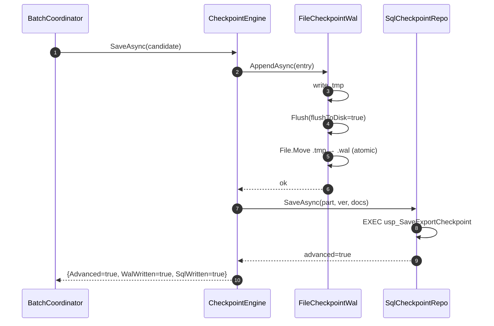
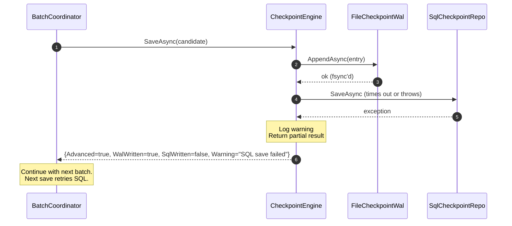
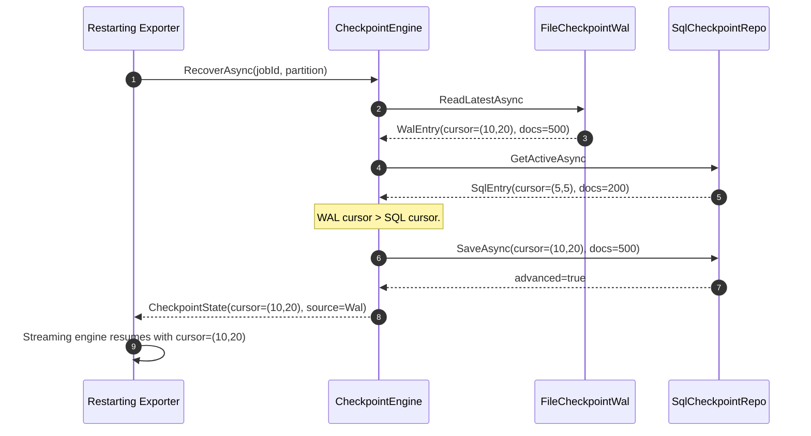

# Checkpoint Engine

**Purpose.** Persist the enumeration cursor at every batch boundary so
the exporter resumes exactly where it left off after any failure: power
outage, application crash, SQL Server restart, host restart, or network
interruption. Layered durability — a local Write-Ahead Log (WAL)
survives infrastructure loss; the SQL Server tracking DB provides cross-
node durability and audit.

---

## 1. Failure model — what we must survive

| Failure | Mechanism that survives it | Notes |
|---|---|---|
| **Power outage** | WAL: `fsync` after every write | Bytes are on the physical medium before `AppendAsync` returns. |
| **Application crash** | WAL: atomic-swap protocol | Either the previous slot or the new slot is visible; never a torn line. |
| **SQL Server restart** | WAL keeps flushing; SQL writes retried via `SqlServerCheckpointRepository` (Polly) | The pipeline does not wait for SQL to come back before advancing. |
| **Server restart** | WAL is on the same volume, re-mounted on boot | If the volume is lost, restore from backup — SQL's active checkpoint takes over. |
| **Network interruption** | Same as SQL restart | SQL write times out (`CheckpointOptions.SqlSaveTimeout`), WAL is still authoritative. |

**Persistence frequency.** The engine is called at the end of every
batch (see `SequentialBatchCoordinator`). Default batch size is 2 000
documents, so the checkpoint advances at roughly one batch per few
seconds under production load.

---

## 2. Two-layer storage

```
                       ┌────────────────────────────────┐
Batch coordinator ───► │  CheckpointEngine              │
                       │  SaveAsync(candidate)          │
                       └───────────┬────────────────────┘
                                   │
                          ┌────────┴────────┐
                          ▼                 ▼
                ┌───────────────────┐   ┌───────────────────────┐
                │  ICheckpointWal   │   │  IExportCheckpoint    │
                │  FileCheckpoint-  │   │  Repository           │
                │  Wal (local file) │   │  SqlServerCheckpoint- │
                │  ──────────────── │   │  Repository (SQL)     │
                │  atomic-swap file │   │  ──────────────────── │
                │  + fsync + CRC32  │   │  usp_SaveExportCheck- │
                │  L1 durability    │   │  point (SP + retry)    │
                └───────────────────┘   └───────────────────────┘
                        ▲                          ▲
                        │                          │
                        │       Recover reads both │
                        │       and returns the    │
                        │       higher cursor.     │
                        │                          │
                       ┌┴──────────────────────────┴┐
                       │  CheckpointEngine          │
                       │  RecoverAsync              │
                       └────────────────────────────┘
```

### 2.1 Write-Ahead Log (L1 durability)

- One file per (job, partition): `checkpoint-{jobId}-{partition}.wal`
- **Single-slot** — the file holds exactly one entry (the latest).
- Line format: `part|ver|docs|isoUtc|crc32hex`
- **Atomic-swap protocol**:
  1. Write the line to `<file>.tmp`
  2. `stream.Flush(flushToDisk: true)` — the fsync equivalent
  3. `File.Move(<file>.tmp, <file>, overwrite: true)` — atomic on NTFS + POSIX
- CRC-32 (IEEE 802.3, hand-rolled, dependency-free) protects against torn
  writes. A partial line is detected on read and treated as no-checkpoint.

**Why single-slot?** The checkpoint is monotonically non-decreasing —
losing the current record and reverting to the previous one is
unnecessary. If the crash happens mid-swap, the OS still exposes the
*previous* atomic version of the file. The idempotency layer in the
work-claim engine guarantees no duplicate exports even when the
checkpoint reverts.

### 2.2 SQL Server tracking DB (L2 durability + audit)

- Delegated to the existing `IExportCheckpointRepository` (which calls
  `usp_SaveExportCheckpoint` — see `docs/database.md`).
- Provides cross-node durability + a durable audit trail via the
  `ExportCheckpoints` table.
- Failure to write here is **logged, not fatal** — the WAL is
  authoritative during the outage, and recovery reconciles on next
  restart.

---

## 3. Recovery algorithm

Executed once at start-up, per (job, partition):

```
recover(jobId, partition):
    walEntry ← wal.ReadLatestAsync(jobId, partition)      // may be null
    sqlEntry ← sqlRepo.GetActiveAsync(jobId, partition)   // may be null

    if both null:
        return CheckpointState.AtOrigin()

    if only walEntry:
        return state_from(walEntry, source = Wal)

    if only sqlEntry:
        return state_from(sqlEntry, source = SqlServer)

    // Both present — pick the higher cursor.
    cmp ← walEntry.Cursor compareTo sqlEntry.Cursor
    if cmp > 0:                                  # WAL ahead
        if ReconcileSqlOnRecovery:
            sqlRepo.SaveAsync(walEntry.Cursor)   # back-fill SQL
        return state_from(walEntry, source = Wal)

    if cmp < 0:                                  # SQL ahead
        wal.AppendAsync(sqlEntry.Cursor)         # back-fill WAL
        return state_from(sqlEntry, source = SqlServer)

    # cmp == 0 — perfectly consistent
    return state_from(both, source = WalAndSql)
```

**Reconciliation** brings both layers into agreement so subsequent
`SaveAsync` calls have a coherent baseline. If either side is
temporarily unavailable, reconciliation retries on the next successful
recovery.

---

## 4. Resume algorithm

`RunExportCommand` calls:

```csharp
var state = await checkpointEngine.RecoverAsync(jobId, partitionKey, ct);

var runOptions = new SqlStreamingRunOptions
{
    // Enumeration resumes strictly past the recovered cursor.
    FetchSize      = 2_000,
    CommandTimeout = TimeSpan.FromSeconds(120),
};
await foreach (var descriptor in sqlStreamingEngine.StreamAsync(
    exclusiveLowerBound: state.Cursor, runOptions, progress, ct))
{
    // ...  process document ...
}
```

The engine's `Cursor` becomes the `exclusiveLowerBound` passed to the
SQL streaming engine. The keyset-paginated query in `MFilesQueries`
translates this into `WHERE dfv.ID_DOCUMENTFILEPART > @lastPart OR
(dfv.ID_DOCUMENTFILEPART = @lastPart AND dfv.ID_VERSIONPART >
@lastVersionPart)` — so **not a single row up to and including the
checkpoint is enumerated again**.

Batch coordinator saves the new checkpoint after each successful batch:

```csharp
foreach (var batch in source.ReadBatchesAsync(...))
{
    await executor.ExecuteAsync(batch, ...);

    var lastKey = batch.Items[^1].DocumentFileVersionKey;
    await checkpointEngine.SaveAsync(jobId, partition,
        new CheckpointCandidate(lastKey, cumulativeProcessed), ct);
}
```

---

## 5. Sequence diagrams

### 5.1 Normal save



### 5.2 SQL unavailable — WAL still succeeds



### 5.3 Recovery after crash — WAL survives



### 5.4 SQL restart between save and recovery

```mermaid
sequenceDiagram
    autonumber
    participant Prev as Exporter (pre-crash)
    participant WAL
    participant SQL
    participant New as Exporter (restart)

    Prev->>WAL: AppendAsync(cursor=(9,9))
    Prev->>SQL: SaveAsync(cursor=(9,9))
    SQL-->>Prev: advanced=true

    Note over Prev,SQL: WAL and SQL agree at (9,9).

    Prev->>WAL: AppendAsync(cursor=(10,10))    # ok, fsync'd
    Prev->>SQL: SaveAsync(cursor=(10,10))
    Note over SQL: SQL Server restarts here
    SQL-->>Prev: connection reset (SqlException 10054)
    Note over Prev: Repository's Polly retry exhausted
    Prev-->>Prev: Log warning; batch continues

    Note over Prev: Exporter process itself crashes soon after.

    New->>WAL: ReadLatestAsync
    WAL-->>New: WalEntry(cursor=(10,10))
    New->>SQL: GetActiveAsync
    SQL-->>New: SqlEntry(cursor=(9,9))          # missed the last update

    Note over New: WAL is ahead — reconcile SQL.
    New->>SQL: SaveAsync(cursor=(10,10))         # succeeds now
    New-->>New: Resume at (10,10)
```

---

## 6. How duplicate exports are prevented after restart

The checkpoint engine is an **efficiency optimisation** — it lets the
exporter skip re-enumerating rows already known to be done. **It is NOT
the correctness mechanism** that prevents duplicate exports. That
guarantee comes from three independent, composed layers:

### 6.1 Layer 1 — Keyset enumeration cursor

The recovered `Cursor` is passed as `exclusiveLowerBound` to the SQL
streaming engine. The query filter is:

```sql
WHERE (dfv.ID_DOCUMENTFILEPART > @lastPart)
   OR (dfv.ID_DOCUMENTFILEPART = @lastPart AND dfv.ID_VERSIONPART > @lastVer)
```

Every row up to and including the cursor is skipped at the source. This
alone would prevent nearly all duplicates.

### 6.2 Layer 2 — Work-claim idempotency

Even if the checkpoint reverts (crash between WAL commit and SQL
commit) and the enumerator re-emits already-processed rows, those rows
go through the work-claim engine before the exporter touches them:

- `dbo.ExportWorkItems` has `UNIQUE (ExportJobId, IdempotencyKey)`
- `usp_ClaimWorkItems` only claims rows with `Status = 'Available'`
- A previously **Completed** row has `Status = 'Completed'` and is
  never re-claimed.

So even in the worst reorg-of-events scenario, a document that was
successfully exported before the crash *cannot* be claimed again.

### 6.3 Layer 3 — Fencing token on completion

If, hypothetically, the checkpoint reverts AND the row's work-item
somehow ended up back at `Available` (it did not; that transition is
impossible for `Completed`), the fencing-token check on
`usp_CompleteWorkItem` would still prevent double-counting. See
`docs/work-claiming-engine.md` §7 for the formal proof.

### 6.4 Sink content-addressability

As a last line of defence, the file sink uses SHA-256-content-addressed
filenames (see `docs/file-export-engine.md`). Two workers writing to the
same content produce byte-identical files at the same path via atomic
rename. There is no way to end up with two distinct artifacts for the
same source document.

**Corollary**: even if the checkpoint were lost entirely and the
exporter restarted from origin, the ONLY consequence would be a full
re-scan of the source with every already-Completed row filtered out at
the claim layer. No duplicate exports would ever appear. **The
checkpoint is a performance optimisation, not a correctness gate.**

---

## 7. Configuration

```jsonc
{
  "Exporter": {
    "Checkpoint": {
      "WalDirectory": "./export-output/checkpoints",
      "FsyncOnWrite": true,
      "PersistToTrackingDb": true,
      "SqlSaveTimeout": "00:00:15",
      "ReconcileSqlOnRecovery": true
    }
  }
}
```

Recommended defaults are production-ready. Only tune:

- **`WalDirectory`** — point at durable local storage (not tmpfs).
- **`FsyncOnWrite = false`** only on ephemeral hardware; disabling loses
  the power-outage safety property.
- **`PersistToTrackingDb = false`** only in single-node deployments
  without the tracking DB (rare; usually the tracking DB is present for
  audit).

---

## 8. Performance

- **WAL write**: one temp-file create + one line write + one fsync +
  one rename. ~1–5 ms on NVMe, ~10–20 ms on spinning storage.
- **SQL write**: one stored-procedure call ~5–20 ms on a healthy
  connection.
- **Overall per-batch overhead**: sub-25 ms — invisible against a
  2 000-item batch that itself takes seconds.

At 5 M docs / 2 000 batch size = ~2 500 checkpoint saves per run —
total overhead well under 1 minute of the multi-hour run.

Memory: single `WalEntry` record + single line buffer — a few hundred
bytes. Nothing scales with corpus size.

---

## 9. Testing

- **`FileCheckpointWalTests`** — round-trip serialization, atomic-swap
  produces no stray temp files, corruption detection via CRC-32,
  partition isolation, no-file-yet behaviour, empty-file recovery,
  malformed-line rejection.
- **`CheckpointEngineTests`** — recovery returns Origin when nothing
  persisted, prefers-higher-cursor across WAL vs SQL divergence,
  reconciliation catches up the lagging side, save-then-recover
  round-trip, SQL failure leaves WAL authoritative, tracking-DB
  disabled skips SQL.

Integration tests (recommended, not shipped) should:

1. Start a save, kill the process before SQL commits — verify next
   recovery returns the WAL value and reconciles SQL.
2. Corrupt the WAL file (truncate last N bytes) — verify recovery
   falls back to SQL cleanly.
3. Point WAL at a filesystem that returns EIO on write — verify the
   engine still logs SQL success and continues.

---

## 10. What this engine does NOT do

- **Does not deduplicate individual documents.** That is the work-claim
  engine's job (§6.2).
- **Does not perform cross-region replication.** Move the WAL directory
  to a network-mounted filesystem (or add an S3 mirror in a decorator)
  if the exporter host itself can be lost.
- **Does not compact the WAL.** The file is bounded to one entry;
  compaction is unnecessary.
- **Does not encrypt the WAL.** File-system-level encryption (LUKS,
  BitLocker, EBS-SSE) is the recommended answer if the cursor value is
  sensitive.
