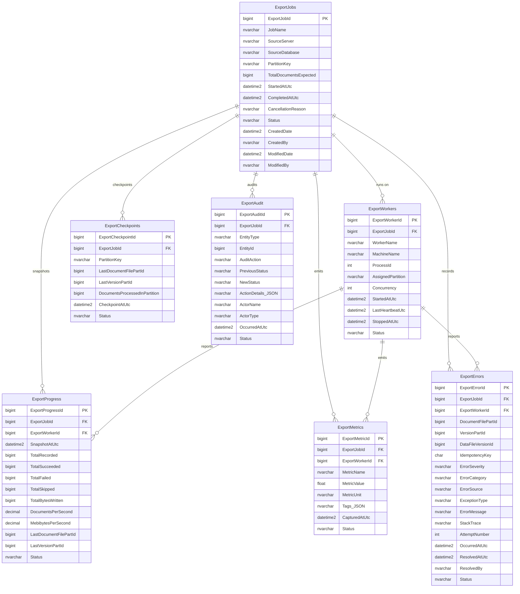

# MFilesExportTracking — Database Design

Dedicated tracking database for the MFilesExporter platform. The exporter is
**read-only** against the M-Files vault; **all** state, progress, metrics,
errors, checkpoints, and audit records are written to this database.

## Deployment order

Run the scripts under `database/` in numeric order against a SQL Server
instance where the deploying principal has `dbcreator` and `securityadmin`
rights.

```
sqlcmd -S <server> -E -i 00-database.sql
sqlcmd -S <server> -E -i 10-tables.sql
sqlcmd -S <server> -E -i 20-indexes.sql
sqlcmd -S <server> -E -i 30-stored-procedures.sql
sqlcmd -S <server> -E -i 40-views.sql
sqlcmd -S <server> -E -i 50-security.sql
sqlcmd -S <server> -E -i 60-maintenance.sql
```

All scripts are idempotent — safe to re-run.

## ER diagram



## Table summary

| Table | Purpose | Cardinality |
|---|---|---|
| `ExportJobs` | One row per export run. Parent of everything. | ~10²/year |
| `ExportWorkers` | Worker instances registered under a job. | ~10¹/job |
| `ExportProgress` | Append-only progress snapshots. | ~10⁴/job |
| `ExportMetrics` | Time-series metric samples. | ~10⁶/job |
| `ExportErrors` | Per-error log with document identifiers. | 10¹–10⁴/job |
| `ExportCheckpoints` | Monotonic enumeration cursors. | ~10⁴/job |
| `ExportAudit` | Immutable audit trail of every state change. | ~10⁴/job |

## Standard columns (every table)

| Column | Type | Notes |
|---|---|---|
| `<Table>Id` | `BIGINT IDENTITY(1,1)` | Surrogate PK, clustered |
| `Status` | `NVARCHAR(32)` | CHECK-constrained enum |
| `CreatedDate` | `DATETIME2(3)` | `DEFAULT SYSUTCDATETIME()` |
| `CreatedBy` | `NVARCHAR(128)` | `DEFAULT SUSER_SNAME()` |
| `ModifiedDate` | `DATETIME2(3)` | `DEFAULT SYSUTCDATETIME()` |
| `ModifiedBy` | `NVARCHAR(128)` | `DEFAULT SUSER_SNAME()` |
| `RowVersion` | `ROWVERSION` | Optimistic concurrency token |

## Stored procedures (public API)

| Procedure | Purpose |
|---|---|
| `dbo.usp_StartExportJob` | Create + start a new job. |
| `dbo.usp_CompleteExportJob` | Terminal transition to Completed / Failed / Cancelled. |
| `dbo.usp_RegisterExportWorker` | Register or re-attach a worker. |
| `dbo.usp_HeartbeatExportWorker` | Update the heartbeat timestamp. |
| `dbo.usp_StopExportWorker` | Mark a worker as Stopped. |
| `dbo.usp_MarkStalledWorkers` | Sweep for stalled workers (SQL Agent). |
| `dbo.usp_RecordExportProgress` | Append a progress snapshot. |
| `dbo.usp_RecordExportMetric` | Append a metric sample. |
| `dbo.usp_LogExportError` | Log a new error and audit it. |
| `dbo.usp_ResolveExportError` | Resolve / ignore an error. |
| `dbo.usp_SaveExportCheckpoint` | Monotonic upsert of the enumeration cursor. |
| `dbo.usp_GetLatestCheckpoint` | Read current Active checkpoint. |
| `dbo.usp_GetLatestProgress` | Read most recent progress snapshot. |
| `ops.usp_ArchiveCompletedJobs` | Move completed jobs → archive tables. |
| `ops.usp_PurgeArchivedData` | Delete archive rows past retention. |
| `ops.usp_ReindexAndUpdateStats` | Rebuild/reorg indexes + update stats. |

## Views (dashboard API)

| View | Purpose |
|---|---|
| `dbo.vw_ActiveJobs` | Running jobs + latest snapshot. |
| `dbo.vw_JobSummary` | All jobs with rollups. |
| `dbo.vw_WorkerHealth` | Worker health / heartbeat freshness. |
| `dbo.vw_ErrorSummary` | Errors grouped by category × severity × status. |
| `dbo.vw_ThroughputHourly` | Hourly throughput rollup for charting. |
| `dbo.vw_CheckpointCurrent` | Current Active cursor per (job, partition). |
| `dbo.vw_AuditRecent` | Last 1 000 audit events. |

---

## Index Strategy

### Design principles

1. **Cluster on the surrogate key** everywhere. Inserts are monotonic;
   fragmentation is bounded and index maintenance is cheap.
2. **Non-clustered indexes back specific queries**, not "columns that might be
   queried". Each index in `20-indexes.sql` names the query it supports.
3. **Filtered indexes** where the active subset is a small fraction of the
   table:
   - `UX_ExportCheckpoints_Active_JobPartition` — only rows with
     `Status = 'Active'` (one per partition).
   - `IX_ExportWorkers_Status_LastHeartbeatUtc` — only rows in
     `('Registered','Active','Idle')` (stall detection scan).
   - `IX_ExportProgress_WorkerId_SnapshotAtUtc` — only rows with a
     worker id.
   - `IX_ExportErrors_DocumentFilePart_VersionPart` — only rows with
     document identifiers.
4. **Include columns** to make dashboard queries fully covered by their
   index, avoiding key lookups.
5. **No LOB columns in indexes**. `NVARCHAR(MAX)` `StackTrace`,
   `ActionDetails` are never included.
6. **Query Store enabled** for adaptive plan analysis.

### Statistics

- `AUTO_UPDATE_STATISTICS_ASYNC = ON` — dashboards never wait on a stats
  refresh.
- Weekly `sp_updatestats` via `ops.usp_ReindexAndUpdateStats`.

### Fragmentation policy

- 5%–30% fragmentation → `REORGANIZE` (online).
- ≥30% fragmentation → `REBUILD` with `ONLINE = OFF`, `MAXDOP = 4` (Standard
  Edition safe). Switch to `ONLINE = ON` on Enterprise editions.

---

## Maintenance Plan

Registered as SQL Agent jobs by `60-maintenance.sql`:

| Job | Schedule | Action |
|---|---|---|
| `MarkStalledWorkers` | every 60 s | Marks workers whose heartbeat is > 120 s old as `Stalled`. |
| `ArchiveCompletedJobs` | daily 02:00 | Moves rows for terminal jobs older than 180 days into `archive.*`. |
| `PurgeArchivedData` | Sunday 03:00 | Deletes archive rows older than 730 days. |
| `ReindexAndUpdateStats` | Saturday 01:30 | Rebuild/reorg fragmented indexes and refresh stats. |

Additional expected external jobs:

| Job | Frequency | Action |
|---|---|---|
| **DBCC CHECKDB** | weekly | `DBCC CHECKDB (MFilesExportTracking) WITH PHYSICAL_ONLY;` |
| **Log backup** | every 15 min | Transaction log backups. |
| **Differential backup** | every 6 h | Cumulative diff. |
| **Full backup** | nightly | Full backup with `WITH CHECKSUM, COMPRESSION`. |
| **Restore test** | monthly | Restore a full+diff+log chain to a scratch instance and run `DBCC CHECKDB`. |

---

## Archiving Strategy

- **Hot vs cold separation** — Hot operational tables live on `PRIMARY`;
  archive shadows live on `ArchiveFG` (a separate filegroup / file) so cold
  storage can move to slower media without impacting live queries.
- **Trigger** — `ops.usp_ArchiveCompletedJobs` archives jobs whose
  `Status ∈ (Completed, Failed, Cancelled)` and whose `CompletedAtUtc` is
  older than 180 days.
- **Order of operations** — child tables first, parent last, all within a
  single transaction batched by `@BatchSize` (default 1 000 jobs per batch)
  so the transaction log does not grow unbounded.
- **Retention** — archive rows are kept for 730 days (2 years) by default,
  purgeable via `ops.usp_PurgeArchivedData`. Adjust to compliance
  requirements.
- **Audit continuity** — even during archive, an `Archived` audit row is
  written to `ExportAudit` before the source rows move.

### Optional: partition-swap acceleration

For very large deployments (millions of rows per week), migrate hot tables
to a monthly partition scheme keyed on `CreatedDate`. Partition switch to
archive is instant (metadata-only). Left as a future enhancement; the
current batch archive procedure handles 5M-document runs comfortably.

---

## Backup Strategy

### Recovery objectives

| Metric | Target |
|---|---|
| **RPO** | ≤ 15 minutes (transaction log cadence) |
| **RTO** | ≤ 30 minutes to a warm standby |

### Backup cadence

| Backup Type | Frequency | Retention | Media |
|---|---|---|---|
| Full | Daily 22:00 | 30 days on-prem, 12 months off-site | Primary backup target + object storage |
| Differential | Every 6 hours | 7 days | Primary backup target |
| Transaction log | Every 15 minutes | 7 days | Primary backup target |

### Options

```sql
BACKUP DATABASE [MFilesExportTracking]
    TO DISK = N'\\backup\MFilesExportTracking\Full_YYYYMMDD.bak'
    WITH CHECKSUM, COMPRESSION, INIT, STATS = 5;

BACKUP LOG [MFilesExportTracking]
    TO DISK = N'\\backup\MFilesExportTracking\Log_YYYYMMDDHHMM.trn'
    WITH CHECKSUM, COMPRESSION, INIT, STATS = 5;
```

- **`WITH CHECKSUM`** — verifies backup integrity as it is written.
- **`WITH COMPRESSION`** — mandatory for the log-heavy audit workload.
- **`RECOVERY FULL`** is set at database create time so log backups are
  valid.

### Restore drills

Restore drill quarterly against a scratch instance:

```sql
RESTORE DATABASE [MFilesExportTracking_Test]
    FROM DISK = N'...\Full_YYYYMMDD.bak'
    WITH NORECOVERY, MOVE 'MFilesExportTracking_Data' TO '...',
                     MOVE 'MFilesExportTracking_Log' TO '...';

RESTORE DATABASE [MFilesExportTracking_Test]
    FROM DISK = N'...\Diff_YYYYMMDDHH.bak'
    WITH NORECOVERY;

-- Apply logs in order:
RESTORE LOG [MFilesExportTracking_Test] FROM DISK = N'...\Log_1.trn' WITH NORECOVERY;
-- ...
RESTORE LOG [MFilesExportTracking_Test] FROM DISK = N'...\Log_N.trn' WITH RECOVERY;

DBCC CHECKDB (N'MFilesExportTracking_Test') WITH PHYSICAL_ONLY;
```

Document the drill result in the ops log; any failure blocks the next
release.

### Disaster recovery

- **Off-site copy** — every full backup is also copied to object storage
  (S3 / Azure Blob) with server-side encryption.
- **Availability Group** — for HA, place the primary DB in an AG. Because
  the exporter is idempotent, promoting a secondary is safe — repeated
  `usp_SaveExportCheckpoint` calls with an already-advanced cursor are
  no-ops.
- **Recovery-from-manifest** — even if the tracking DB is lost, the
  exporter's JSONL manifests on the output volume can rebuild the state
  store. See `docs/architecture.md`.
