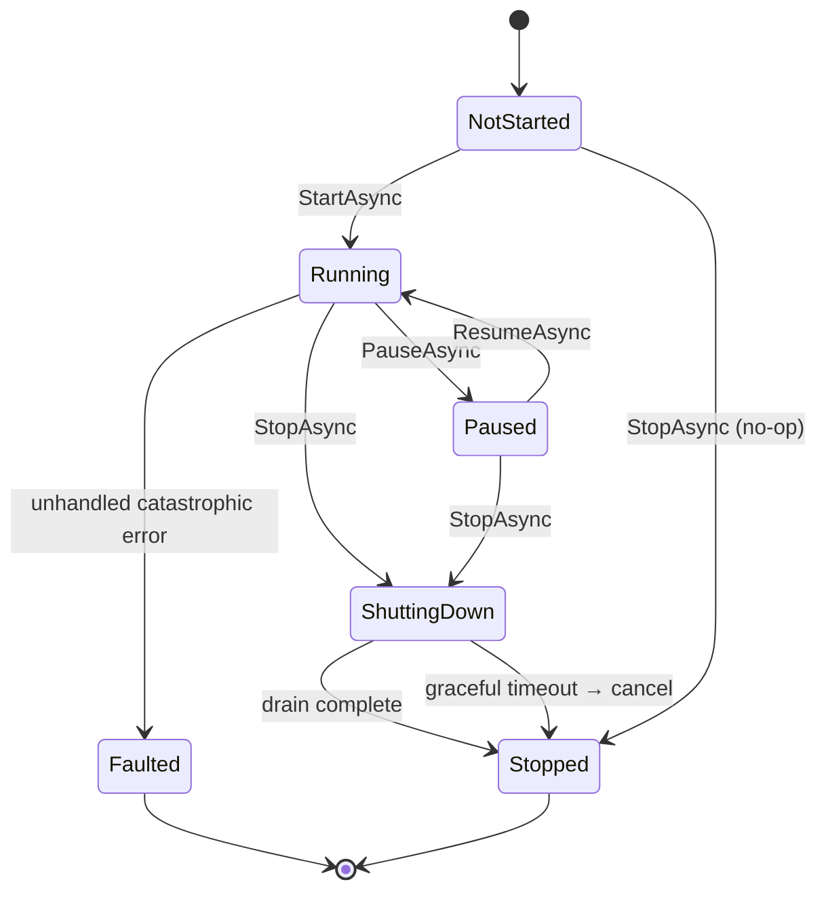
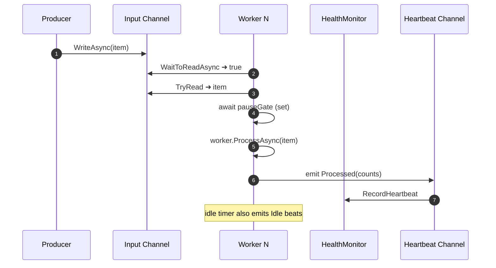
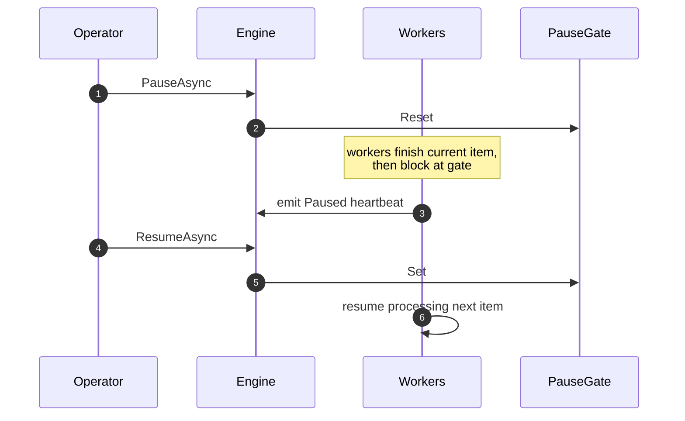
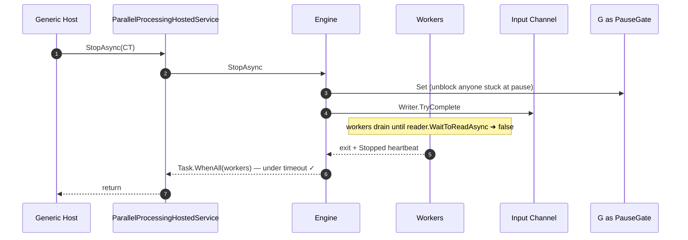
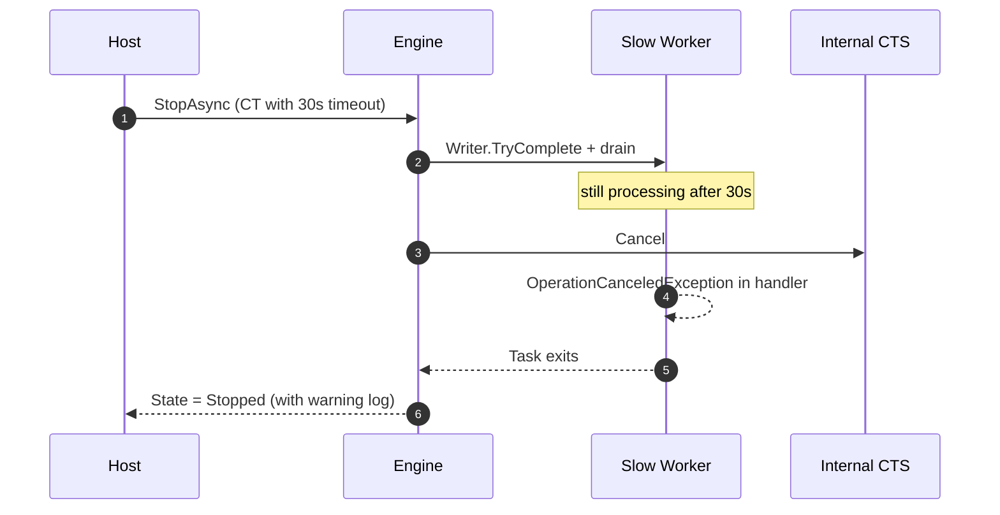

# Parallel Processing Engine

**Purpose.** A reusable, hosted, generic producer/consumer engine built on
`System.Threading.Channels`, a fixed worker pool, per-worker heartbeats,
and an async pause gate. Hostable as an `IHostedService`; consumers push
items via a `ChannelWriter<TItem>` and implement one small
`IParallelWorker<TItem>`.

Distinct from the export-specific batch coordinator: the batch coordinator
processes bounded batches to completion; the parallel engine is a
continuous stream processor.

---

## 1. Architecture

```
                ┌────────────────────────────────────────────────────┐
    Producers → │  ChannelWriter<TItem>  (Writer property)           │
                └──────────────────────┬─────────────────────────────┘
                                       ▼
                          ┌────────────────────────────┐
                          │  Bounded Channel<TItem>    │
                          │  capacity = ChannelCapacity│
                          │  FullMode = Wait|Drop*     │
                          └───────────┬────────────────┘
                                      │ N readers
              ┌───────────────────────┼──────────────────────────┐
              ▼                       ▼                          ▼
    ┌──────────────────┐    ┌──────────────────┐        ┌──────────────────┐
    │  Worker 0        │    │  Worker 1        │  ...   │  Worker N-1      │
    │  (Task)          │    │                  │        │                  │
    │  await pauseGate │    │                  │        │                  │
    │  IParallelWorker │    │                  │        │                  │
    │  ...             │    │                  │        │                  │
    │  Heartbeat every │    │                  │        │                  │
    │  N seconds       │    │                  │        │                  │
    └────────┬─────────┘    └────────┬─────────┘        └────────┬─────────┘
             │                       │                           │
             ▼                       ▼                           ▼
          ┌──────────────────────────────────────────────┐
          │  ChannelWriter<WorkerHeartbeatEvent>         │
          │  (unbounded — never dropped)                 │
          └──────────────────────┬───────────────────────┘
                                 │
              ┌──────────────────┴────────────────┐
              ▼                                   ▼
      ┌───────────────────┐              ┌─────────────────────┐
      │ WorkerHealth-     │              │ IAsyncEnumerable    │
      │ Monitor (live     │              │ Heartbeats stream   │
      │ per-worker state) │              │ (observers)         │
      └───────────────────┘              └─────────────────────┘
```

**Data structures**

- **Input channel** — `Channel.CreateBounded<TItem>` with capacity =
  `ChannelCapacity`. Back-pressure via `FullMode.Wait` (recommended);
  drop-old / drop-new available.
- **Heartbeat channel** — unbounded. Heartbeats are tiny; dropping one
  would defeat the point of health monitoring.
- **Async pause gate** — `AsyncManualResetEvent`. Set = workers proceed;
  Reset = workers block at the top of each iteration.
- **Worker tasks** — one `Task` per worker, spawned in `StartAsync`.
- **Internal CTS** — cancels every worker when graceful shutdown times out.

---

## 2. Services

| Type | Role |
|---|---|
| `IParallelProcessingEngine<TItem>` | Port. Producers use `Writer`; operators use `PauseAsync`, `ResumeAsync`, `StopAsync`, `GetStatus`. |
| `ParallelProcessingEngine<TItem>` | Default implementation (this document). |
| `IParallelWorker<TItem>` | Consumer contract. Implement once per item type. Stateless. |
| `WorkerContext` | Ambient per-worker state (WorkerId, PoolName, ItemsProcessed). |
| `AsyncManualResetEvent` | The pause gate primitive. |
| `WorkerHealthMonitor` | Tracks the last heartbeat per worker; produces snapshots. |
| `WorkerHeartbeatEvent` | Struct emitted by each worker; carries kind + counters. |
| `EngineStatus` | Point-in-time diagnostic snapshot. |
| `ParallelProcessingHostedService<TItem>` | `IHostedService` that starts/stops the engine with the .NET Generic Host. |

**DI shortcut**:

```csharp
services.AddParallelProcessing<MyItem>();          // engine + hosted service
services.AddSingleton<IParallelWorker<MyItem>, MyItemWorker>();
```

The shared `WorkerHealthMonitor` is registered once by
`AddExporterExport()`.

---

## 3. Worker lifecycle



**Per-worker loop** (annotated):

```csharp
while (await reader.WaitToReadAsync(ct))            // ① observe end-of-input
{
    if (!reader.TryRead(out var item)) continue;

    if (!pauseGate.IsSet)                            // ② fast path when open
        await pauseGate.WaitAsync(ct);               //    blocks here when paused

    try
    {
        await worker.ProcessAsync(item, context, ct);// ③ user handler
        itemsProcessed++;
        EmitHeartbeat(Processed, itemsProcessed);
    }
    catch (OperationCanceledException) { throw; }
    catch (Exception ex)                             // ④ handler failed
    {
        itemsFailed++;
        EmitHeartbeat(Failed, itemsProcessed, itemsFailed);
        // Loop continues — one bad item never shrinks the pool.
    }
}
// exit ⇒ EmitHeartbeat(Stopped) + monitor.MarkStopped
```

Every worker also runs a **periodic timer** in parallel that emits an
`Idle` heartbeat every `HeartbeatInterval` — so the health monitor sees
liveness even when no items are flowing.

---

## 4. Configuration

```jsonc
{
  "Exporter": {
    "ParallelProcessing": {
      "WorkerCount": 8,
      "ChannelCapacity": 128,
      "FullMode": "Wait",                    // Wait | DropOldest | DropNewest
      "HeartbeatInterval": "00:00:05",
      "StalledThreshold": "00:00:30",
      "GracefulShutdownTimeout": "00:00:30",
      "RestartWorkersOnFault": false
    }
  }
}
```

| Setting | Default | Notes |
|---|---|---|
| `WorkerCount` | 8 | Sized to typical I/O-bound workloads. |
| `ChannelCapacity` | 128 | Bounded producer back-pressure. |
| `FullMode` | `Wait` | Drop modes are supported but rarely appropriate. |
| `HeartbeatInterval` | 5 s | Idle-beat cadence. |
| `StalledThreshold` | 30 s | Workers overdue by this long → `Stalled`. |
| `GracefulShutdownTimeout` | 30 s | Time given for in-flight items to drain. |
| `RestartWorkersOnFault` | false | Reserved for future auto-restart; currently no-op. |

---

## 5. Performance tuning

### 5.1 Choosing `WorkerCount`

| Workload profile | Rule of thumb |
|---|---|
| **CPU-bound** (encoding, hashing) | `Environment.ProcessorCount` |
| **I/O-bound**, one downstream service (DB, HTTP) | 2× `ProcessorCount`, tuned to downstream connection limit |
| **I/O-bound**, mixed downstream | Start with 16, watch `Stalled` count |
| **Streaming file writes** | 8–32; depends on IOPS ceiling |

### 5.2 Choosing `ChannelCapacity`

- Producers should never block for more than `HeartbeatInterval` — set
  capacity so the average producer emit rate × handler duration stays
  under capacity.
- Rule of thumb: `4 × WorkerCount` when items are small, `1 × WorkerCount`
  when items carry non-trivial payload (e.g. a large in-memory struct).
- Set very low (≤ WorkerCount) when you want tight back-pressure.

### 5.3 Heartbeat cadence

- Too fast: idle-beat storm floods the heartbeat channel + health monitor.
- Too slow: stalled workers detected slowly; UI dashboards stale.
- Rule: `HeartbeatInterval = StalledThreshold / 6` — gives you ~6 beats
  before a healthy worker is considered stalled.

### 5.4 Full-mode selection

- **Wait** (default) — the producer respects the consumer's rate. Correct
  in the vast majority of cases.
- **DropOldest / DropNewest** — never appropriate for exports, but useful
  for pure telemetry pipelines where losing a sample is preferable to
  back-pressuring the producer.

### 5.5 Cancellation cost

- `cancellationToken.ThrowIfCancellationRequested()` is a volatile read
  — safe to check every iteration.
- Pause gate short-circuits when set (`Task.CompletedTask`).
- Heartbeat emit is a single `channel.TryWrite` + one `Interlocked` +
  one dictionary update — negligible.

### 5.6 Memory profile

| Component | Peak memory |
|---|---|
| Bounded channel of size N | `N × sizeof(TItem)` (typically 128 × <1 KB) |
| Per-worker context | ~64 B |
| Heartbeat queue | Unbounded but drained by health monitor immediately |
| Health monitor state | `O(WorkerCount)` |

At 8 workers + 128 capacity + small `TItem` — under 1 MB total.

---

## 6. Sequence diagrams

### 6.1 Normal steady state



### 6.2 Pause / resume



### 6.3 Graceful shutdown



### 6.4 Shutdown timeout — force cancellation



---

## 7. Health monitoring

`GetStatus()` returns an `EngineStatus` snapshot at any point:

```csharp
public sealed record EngineStatus(
    EngineState State,                                  // Running / Paused / …
    int WorkerCount,
    int ItemsInChannel,                                 // approximate queue depth
    long TotalItemsProcessed,
    long TotalItemsFailed,
    IReadOnlyList<WorkerStatusSnapshot> Workers,        // per-worker liveness
    DateTimeOffset ObservedAtUtc);
```

Each worker snapshot carries:

```csharp
public sealed record WorkerStatusSnapshot(
    int WorkerId,
    WorkerLiveness Liveness,          // Healthy | Stalled | Stopped
    long ItemsProcessed,
    DateTimeOffset LastHeartbeatUtc,
    TimeSpan HeartbeatAge);
```

Wire this into your health probe:

```csharp
services.AddHealthChecks().AddCheck("parallel-engine", () =>
{
    var status = engine.GetStatus();
    var stalled = status.Workers.Count(w => w.Liveness == WorkerLiveness.Stalled);
    if (stalled > 0)
        return HealthCheckResult.Degraded($"{stalled} workers stalled");
    return HealthCheckResult.Healthy();
});
```

Or subscribe to the async stream for real-time metrics:

```csharp
await foreach (var heartbeat in engine.Heartbeats.WithCancellation(ct))
{
    metrics.RecordHeartbeat(heartbeat);
}
```

---

## 8. Usage sketch

### 8.1 Wiring

```csharp
// Options via appsettings.json (see §4)

services.AddExporterConfiguration(builder.Configuration);
services.AddExporterExport();                      // registers WorkerHealthMonitor
services.AddParallelProcessing<InvoiceExportItem>();
services.AddSingleton<IParallelWorker<InvoiceExportItem>, InvoiceExporter>();
```

### 8.2 Worker implementation

```csharp
public sealed class InvoiceExporter : IParallelWorker<InvoiceExportItem>
{
    private readonly IFileExportEngine _fileExport;

    public InvoiceExporter(IFileExportEngine fileExport) => _fileExport = fileExport;

    public async Task ProcessAsync(InvoiceExportItem item, WorkerContext ctx, CancellationToken ct)
    {
        // Do the work. Exceptions are logged by the engine and the worker
        // continues with the next item.
        await using var content = await item.OpenContentAsync(ct);
        await _fileExport.ExportAsync(new FileExportContext { /* ... */ }, content, ct);
    }
}
```

### 8.3 Producer

```csharp
public sealed class InvoiceProducer(IParallelProcessingEngine<InvoiceExportItem> engine)
{
    public async Task ProduceAsync(IAsyncEnumerable<InvoiceExportItem> items, CancellationToken ct)
    {
        await foreach (var item in items.WithCancellation(ct))
        {
            await engine.Writer.WriteAsync(item, ct);   // back-pressure applies
        }
        engine.Writer.TryComplete();                    // signal end-of-work
    }
}
```

### 8.4 Operations

```csharp
await engine.PauseAsync(ct);      // pause for maintenance
await engine.ResumeAsync(ct);     // resume when ready
await engine.StopAsync(ct);       // graceful shutdown
var status = engine.GetStatus();  // dashboard snapshot
```

---

## 9. Testing

Under `tests/MFilesExporter.Tests/Export/Parallel/`:

- **`AsyncManualResetEventTests`** — initial-set fast path, reset blocks
  waiters, set releases waiters, reset-after-set blocks new waiters,
  reset idempotency.
- **`WorkerHealthMonitorTests`** — registration produces snapshots,
  stale heartbeat flags as Stalled, `Stopped` label freezes, totals sum
  across workers, `MarkStopped` transitions cleanly.
- **`ParallelProcessingEngineTests`** — processes every item under
  shutdown, exhibits configured parallelism, pause/resume halts and
  resumes processing, graceful shutdown drains, handler exceptions do
  not stop the engine, status reflects state, heartbeats emit via async
  stream, `StartAsync` is idempotent.

---

## 10. What this engine does NOT do

- **Does not route items by key** — every worker draws from the same
  channel. If you need affinity (partition-per-worker), wrap this engine
  in a router that owns N engines, one per partition.
- **Does not persist queued items** — a hard crash loses whatever was in
  the input channel. Combine with a durable claim engine
  (`docs/work-claiming-engine.md`) for at-least-once semantics.
- **Does not adjust `WorkerCount` at runtime** — set at engine
  construction. To resize, stop and re-create.
- **Does not fan-out to a downstream channel** — this is a single-stage
  worker pool. For multi-stage pipelines, chain multiple engines
  producer-to-consumer.
