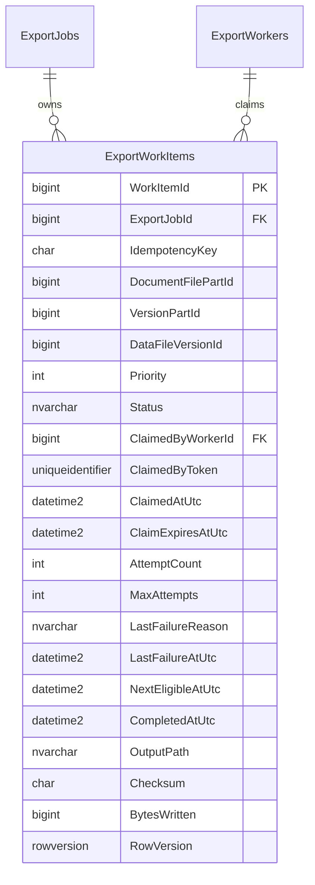
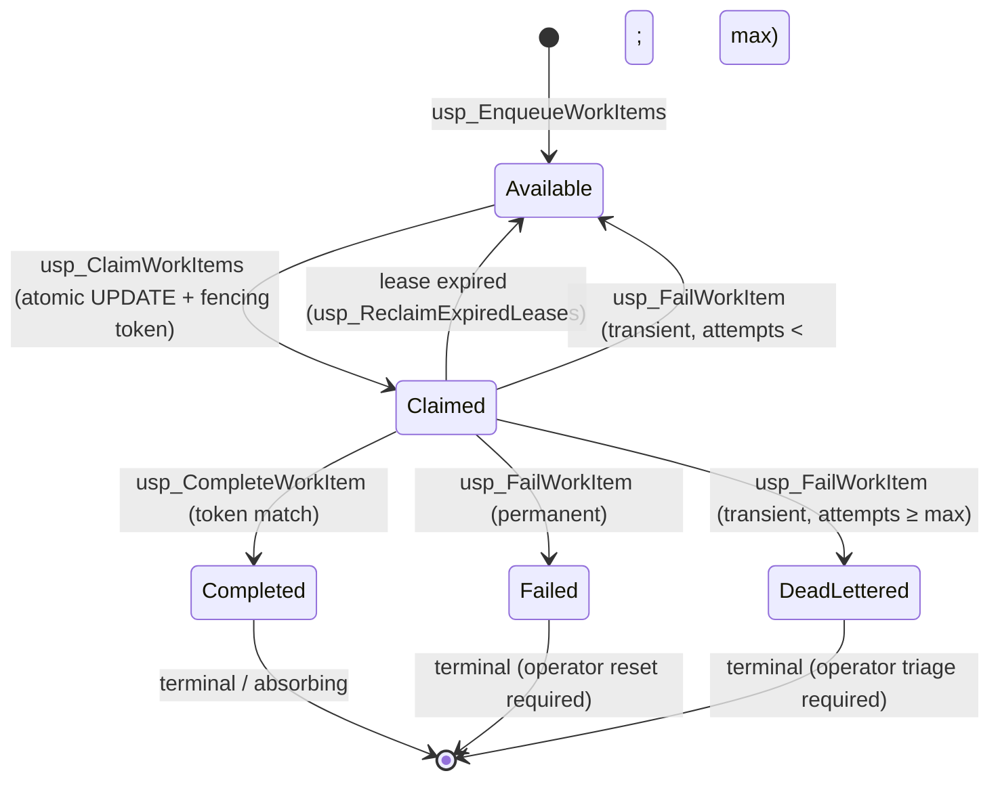
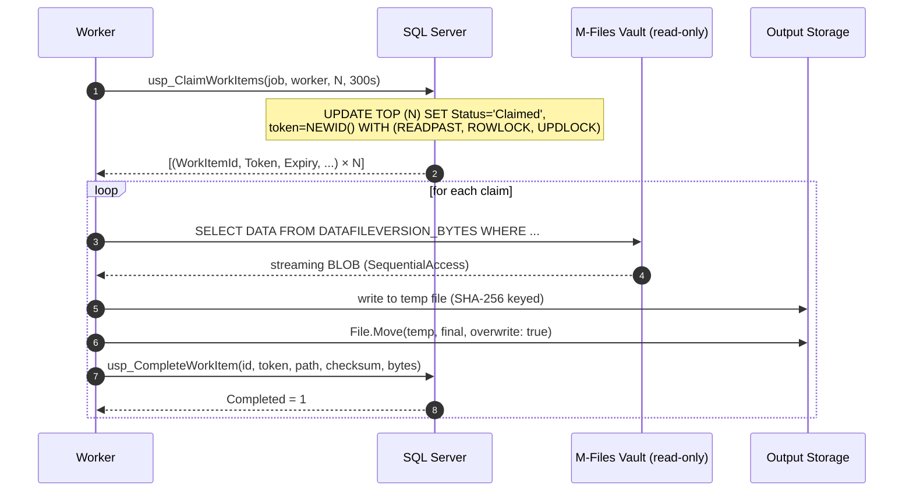

# Distributed Work-Claiming Engine

**Scope**: Distribute ~5 041 559 documents across an arbitrary number of
concurrent workers (threads within one process, and/or independent hosts)
with zero duplicate exports, automatic crash recovery, and bounded latency.

**Approach**: SQL Server plays the role of a durable, transactional work
queue. Every state transition is an atomic stored procedure with row-level
locking; every claim carries a fencing token that guarantees at-most-once
completion.

---

## 1. Requirements → design mapping

| Requirement | Mechanism |
|---|---|
| A document must NEVER be exported twice | `UNIQUE (ExportJobId, IdempotencyKey)` + fencing-token check on Complete + absorbing `Completed` state |
| Workers must atomically claim work | Single `UPDATE TOP (@N) ... OUTPUT` with `READPAST + ROWLOCK + UPDLOCK` |
| Workers may crash unexpectedly | Lease-based ownership — no worker-side liveness protocol needed |
| Claimed work must automatically expire | `ClaimExpiresAtUtc` + reaper sweep (`usp_ReclaimExpiredLeases`) |
| Expired work must become available again | Reaper flips `Status` back to `Available` and clears the token |
| Completed work must never be reclaimed | `Completed` is absorbing; no stored procedure writes from `Completed` |
| Failed work must support retries | `usp_FailWorkItem` bumps attempts, returns to `Available` with backoff (or `DeadLettered` after `MaxAttempts`) |

---

## 2. Architecture

```
                                 SQL Server (MFilesExportTracking)
                              ┌────────────────────────────────────┐
                              │   dbo.ExportWorkItems              │
                              │   ┌─── Available (queue)           │
                              │   │─── Claimed (in progress)       │
                              │   │─── Completed (terminal)        │
                              │   │─── Failed / DeadLettered       │
                              │   └── Indexes:                     │
                              │       IX_ClaimCandidate (filtered) │
                              │       IX_ExpiredLease (filtered)   │
                              └───┬───────────────┬───────────────┬┘
                                  │               │               │
                     usp_ClaimWorkItems  usp_CompleteWorkItem  usp_FailWorkItem
                     usp_RenewWorkItemLease  usp_ReclaimExpiredLeases
                                  │               │               │
                                  ▼               ▼               ▼
                      ┌────────────────────────────────────────────┐
                      │  IWorkClaimStore  (Application port)       │
                      └───┬───────────┬────────────┬───────────────┘
                          │           │            │
                          ▼           ▼            ▼
                    ┌──────────┐ ┌──────────┐ ┌──────────┐
                    │ Worker 1 │ │ Worker 2 │ │ Worker N │  (threads / hosts)
                    └──────────┘ └──────────┘ └──────────┘
                          │           │            │
                          ▼           ▼            ▼
                      ┌────────────────────────────────────┐
                      │  Reaper (SQL Agent job, 30 s)       │
                      │  usp_ReclaimExpiredLeases           │
                      └────────────────────────────────────┘
```

Workers only ever talk to the store through the six stored procedures. They
never SELECT from the base table (that would race with concurrent claims).

---

## 3. Data model



**Uniqueness invariant**: `UNIQUE (ExportJobId, IdempotencyKey)` means at
most one row exists per (job, document). Re-running enumeration is safe;
the enqueue proc `INSERT ... WHERE NOT EXISTS`.

**Filtered indexes**:
- `IX_ExportWorkItems_ClaimCandidate WHERE Status = 'Available'` — the
  claim `UPDATE`'s driving index. Filtered so scans skip claimed/completed
  rows entirely.
- `IX_ExportWorkItems_ExpiredLease WHERE Status = 'Claimed'` — the reaper's
  driving index. Filtered so the sweep never touches terminal rows.

---

## 4. State diagram



**Absorbing states** (`Completed`, `Failed`, `DeadLettered`) have no
outgoing transitions in any stored procedure. This is the key structural
property that makes duplicate exports impossible — see §7.

---

## 5. Sequence diagrams

### 5.1 Happy path — claim, work, complete



### 5.2 Long-running item — lease renewal

```mermaid
sequenceDiagram
    autonumber
    participant W as Worker (slow BLOB)
    participant DB as SQL Server

    W->>DB: usp_ClaimWorkItems(..., 300s lease)
    DB-->>W: [(id, token, expires_at)]

    Note over W: BLOB is large; expected duration &gt; lease

    par worker processing
        W->>Src: streaming BLOB
    and lease renewal loop (every 60s)
        W->>DB: usp_RenewWorkItemLease(id, token, +300s)
        alt token still owns claim
            DB-->>W: Extended=1, NewExpires=now+300s
        else lease already stolen
            DB-->>W: Extended=0
            W->>W: abandon (do not attempt Complete)
        end
    end
```

### 5.3 Crash and reclamation

```mermaid
sequenceDiagram
    autonumber
    participant Wa as Worker A
    participant Wb as Worker B
    participant DB as SQL Server
    participant R as Reaper (SQL Agent)

    Wa->>DB: usp_ClaimWorkItems (10 items, 300s lease)
    DB-->>Wa: [items with tokens]

    Note over Wa: Worker A crashes mid-processing.
    Note over DB: No inbound Complete for those items;<br/>ClaimExpiresAtUtc passes.

    R->>DB: usp_ReclaimExpiredLeases()
    Note over DB: UPDATE SET Status='Available',<br/>ClaimedByToken=NULL,<br/>NextEligibleAtUtc = now + 30s<br/>WHERE Status='Claimed' AND ClaimExpiresAtUtc &lt; now
    DB-->>R: [reclaimed WorkItemIds]

    Wb->>DB: usp_ClaimWorkItems(...)
    DB-->>Wb: [same items with NEW tokens]
    Wb processes normally.
```

### 5.4 Zombie writer — race between old worker's Complete and reaper

```mermaid
sequenceDiagram
    autonumber
    participant Wa as Worker A (slow)
    participant Wb as Worker B (fresh)
    participant DB as SQL Server

    Wa->>DB: usp_ClaimWorkItems → tokenA, expires t1
    DB-->>Wa: [item i, tokenA]
    Note over Wa: A's clock drifts; treats lease as still valid.

    Note over DB: t1 passes. Reaper marks Available. Token cleared.

    Wb->>DB: usp_ClaimWorkItems → tokenB (new)
    DB-->>Wb: [item i, tokenB]

    Wa->>DB: usp_CompleteWorkItem(i, tokenA, ...)
    Note over DB: WHERE ClaimedByToken=tokenA AND Status='Claimed'<br/>→ 0 rows affected
    DB-->>Wa: Completed=0
    Note over Wa: Abandon; do not double-count.

    Wb->>DB: usp_CompleteWorkItem(i, tokenB, ...)
    DB-->>Wb: Completed=1
```

---

## 6. Stored procedures

Six atomic procedures — all with `SET XACT_ABORT ON`, all row-level.

| Procedure | Purpose |
|---|---|
| `usp_EnqueueWorkItems` | Bulk INSERT of new items via a TVP. Duplicate `(job, key)` pairs are silently no-op. |
| `usp_ClaimWorkItems` | The atomic claim. Returns up to `@BatchSize` items with fresh tokens and a lease. |
| `usp_RenewWorkItemLease` | Extend an active lease. Requires token match. |
| `usp_CompleteWorkItem` | Mark Completed. Requires token match. Returns `@Completed = 0` when the token is stale. |
| `usp_FailWorkItem` | Return to Available (transient) or move to Failed/DeadLettered (permanent or exhausted). Requires token match. |
| `usp_ReclaimExpiredLeases` | Sweep expired-lease rows back to Available. Runs every 30 s via SQL Agent. |

Full DDL: `database/70-work-claiming-tables.sql` and
`database/71-work-claiming-procs.sql`.

---

## 7. Why duplicate processing is impossible

**Theorem.** For any work item `W`, the transition `Claimed → Completed`
happens *at most once*.

**Proof.**

1. **Uniqueness of the row.** `UNIQUE (ExportJobId, IdempotencyKey)` means
   exactly one row exists per (job, document). Enqueue is idempotent via
   `INSERT ... WHERE NOT EXISTS`.

2. **`Completed` is absorbing.** No stored procedure updates a row whose
   `Status = 'Completed'`. Each mutation has `WHERE Status = 'Claimed'` in
   its predicate. Therefore once `W.Status = 'Completed'`, it stays there.

3. **Only the token-holder can complete.** `usp_CompleteWorkItem` has:

   ```
   WHERE WorkItemId = @WorkItemId
     AND ClaimedByToken = @ClaimToken
     AND Status = 'Claimed';
   ```

   The `ClaimedByToken` column carries **exactly one value at a time** —
   only `usp_ClaimWorkItems` writes it (`NEWID()`), and every other proc
   either preserves it (Renew) or clears it to NULL (Complete, Fail,
   Reclaim). Two different tokens can never coexist for `W`.

4. **Claim is atomic per row.** The claim UPDATE runs under
   `WITH (ROWLOCK, UPDLOCK)`. Two concurrent claimers cannot both flip the
   same row from `Available` to `Claimed` — the second one blocks (or,
   with `READPAST`, skips the locked row and picks a different one).

5. **Composition.** From (1) there is one row; from (2)/(3) at most one
   Complete succeeds per active token; from (4) at most one active token
   exists at a time; therefore at most one Complete transition happens
   over the row's entire lifetime. Q.E.D.

**Corollary.** Even if:
- Worker A's clock is skewed and it believes its lease is still valid, or
- Worker A stalls in the network for hours and then reappears with a
  belated `CompleteWorkItem` call, or
- The reaper prematurely reclaims a row that Worker A was still working on,

Worker A's `CompleteWorkItem` call returns `@Completed = 0` because
`ClaimedByToken` no longer matches. Worker A must treat this as "wasted
work" and MUST NOT update aggregate counters. The state store shows
exactly one Completion — the one made by the current token-holder.

**On duplicate sink writes.** Two workers may briefly both write to the
sink during a lease overlap. Because the sink filenames are keyed by
SHA-256 of the source triple **and** the source content is deterministic,
the resulting file is bit-identical no matter who writes it. `File.Move`
with `overwrite: true` is atomic on the same volume. The *artifact* is
therefore unique-per-content; the *state* is unique-per-work-item. The
observable exported set is a mathematical set (idempotent), and the
audit log records exactly one Completion per document.

---

## 8. Failure modes and mitigations

| Failure | Mitigation |
|---|---|
| Worker crashes mid-BLOB | Lease expires → reaper returns row to Available → different worker claims |
| Worker deadlocks the SQL Server side | Claim uses `READPAST` — other workers skip the locked row |
| Network partition between worker and DB | Renew returns 0 → worker abandons; reaper takes over |
| Clock skew on the worker | Complete/Fail/Renew all check the DB-side token; worker clock is irrelevant to correctness |
| Reaper too slow | Not a correctness problem — items just sit in `Claimed` until the reaper runs; only latency degrades |
| Reaper too aggressive | Not a correctness problem — leases renewed frequently by long-running workers |
| Concurrent claim races | `ROWLOCK + UPDLOCK` serializes the write phase; `READPAST` scatters concurrent claimers across different rows |
| SQL Server transient errors during claim | Wrapped in the resilience pipeline (`sql-tracking`); retried with exponential backoff |
| Source-side row flip (`UPLOADCOMMITTED` → 0) between claim and BLOB fetch | Content query re-checks the filter; missing BLOB → `usp_FailWorkItem(permanent)` → row becomes `Failed` |

---

## 9. Operational knobs

| Setting | Location | Recommended | Effect |
|---|---|---|---|
| Lease duration | `LeaseDuration` in `ClaimWorkBatchCommand` | 5 min | Longer = fewer renewals; shorter = faster reclamation on crash |
| Batch size | `BatchSize` in `ClaimWorkBatchCommand` | 100–1000 | Larger = fewer round-trips; smaller = more even distribution |
| Renewal interval | Worker-side timer | 60 s (with 5 min lease) | Renew at half-lease is safe |
| Retry backoff | `Backoff` in `FailWorkItemCommand` | 60 s | Prevents thrashing on transient failures |
| Reaper sweep interval | SQL Agent schedule | 30 s | Bounds worst-case reclamation delay |
| Reaper backoff after reclaim | `RetryBackoff` in `usp_ReclaimExpiredLeases` | 30 s | Gives a crashed worker time to be noticed before its work is picked up by another |
| MaxAttempts | Per-row (default 5) | 5 | Prevents infinite retries on a poison document |

---

## 10. C# surface

The layer exposes:

- **`IWorkClaimStore`** (application port).
- Five use cases as `ICommand<T>` records with matching handlers:
  - `ClaimWorkBatchCommand` → `IReadOnlyList<ClaimedWorkItem>`
  - `CompleteWorkItemCommand` → `bool` (token still owned?)
  - `FailWorkItemCommand` → `bool`
  - `RenewLeaseCommand` → `DateTimeOffset?` (new expiry or `null`)
  - `ReclaimExpiredCommand` → `int` (count reclaimed)
- **`SqlWorkClaimStore`** (persistence adapter).
- **Domain records**: `WorkItemId`, `WorkItemStatus`, `ClaimToken`,
  `ClaimedWorkItem`, `WorkItemEnqueueRequest`.

Every method takes a `CancellationToken` and returns an `ApplicationResult`
(or `ApplicationResult<T>`) so the pipeline can react to failures without
exceptions.

---

## 11. Testing strategy

- **Unit** (`WorkClaimingHandlersTests.cs`) — every handler tested with an
  `IWorkClaimStore` fake:
  - Happy path forwards to store.
  - Validation errors block the store call.
  - `Complete` returning `false` is a *success* with value `false` — not
    an error. This is the critical distinction the code MUST preserve.
- **Integration** (recommended, not shipped) — spin up a real SQL Server
  in Testcontainers, run the SQL scripts, run these tests:
  - Two concurrent `ClaimAsync(N)` calls never return the same
    `WorkItemId`.
  - Complete with a stale token returns `false` and does not change the
    row.
  - Reaper reclaims a row whose lease expired; a subsequent claim receives
    a fresh token; the old token can neither Complete nor Renew.
  - A `Completed` row is never re-claimed regardless of what the reaper
    does.

---

## 12. What could go wrong that this design does NOT solve

- **Byzantine workers** — a malicious worker that lies about the payload
  it wrote. This engine trusts the worker's Complete call. If untrusted
  workers are in scope, add server-side hash verification.
- **Cross-region strong consistency** — SQL Server AG async replication
  can lose a claim under failover. If cross-region HA is required, use
  synchronous replicas or move the queue to a strongly-consistent
  distributed KV (etcd, DynamoDB with conditional writes).
- **Very short work items** — if a document takes < 1 second, the claim
  round-trip dominates. Batch further (claim 1000 items per call) and
  pipeline the work.

None of these are in scope for the current requirements; documented here
so the trade-offs are explicit.
